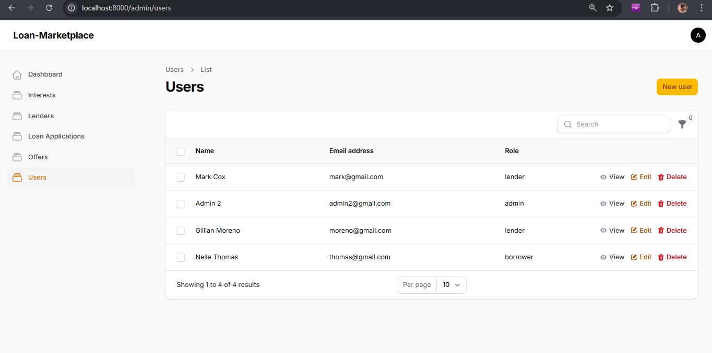

# 📑 Loan Marketplace – Laravel Project Test

## 📌 Deskripsi Singkat
Proyek ini merupakan prototipe **Platform Pinjaman Online** (Loan Marketplace) sederhana menggunakan **Laravel + Filament + MySQL**.  

Fitur utama:
- **Borrower** (peminjam) dapat mengajukan pinjaman.  
- **Lender** (pemberi pinjaman) dapat menawarkan bunga & tenor, Menyetujui permintaan penawaran peminjam.  
- **Admin** mengelola data user, lender, borrower, dan interest.  
- Sistem menyimpan **Offer** antara borrower dan lender.  

## 🚀 Alur Aplikasi

### 1. Borrower Registrasi & Login
- Borrower melakukan **registrasi** atau login ke sistem.
- Setelah login, borrower bisa mengakses dashboard pribadi.

### 2. Borrower Membuat Loan Application
- Borrower mengisi form pinjaman (jumlah pinjaman, tenor, tujuan pinjaman).
- Data tersimpan di tabel `loan_applications`.

### 3. Borrower Melihat & Memilih Penawaran
- Sistem menampilkan daftar **penawaran (offers)** dari lender berdasarkan interest & tenor yang tersedia.
- Borrower dapat memilih satu penawaran dan mengajukan **permintaan persetujuan** ke lender.
- Status offer default: `pending`.

### 4. Lender Login & Review Penawaran
- Lender login ke dashboard.
- Lender melihat daftar permintaan persetujuan offer.
- Lender bisa memilih **accept / reject**.
  - Jika **accept** → status `accepted`, borrower mendapatkan kepastian pinjaman.
  - Jika **reject** → status `rejected`, borrower harus memilih offer lain atau menunggu.


---

## 🛠️ Tech Stack
- **Backend**: Laravel 10  
- **Frontend**: Blade + Tailwind  
- **Panel Admin**: FilamentPHP  
- **Database**: MySQL 8+  
- **Auth**: Laravel Breeze / default Auth  

---

## ⚙️ Setup Proyek

### 1. Clone Repository
```bash
git clone https://github.com/BagusFary/loan-marketplace
cd loan-marketplace
```

### 2. Install Dependencies
```bash
composer install
npm install && npm run build
```

### 3. Copy .env & Generate Key
```bash
cp .env.example .env
php artisan key:generate
```

```bash
DB_CONNECTION=mysql
DB_HOST=127.0.0.1
DB_PORT=3306
DB_DATABASE=loan_marketplace
DB_USERNAME=root
DB_PASSWORD=
```

### 4. Migrasi Database
```bash
php artisan migrate
```

### 5. Jalankan Seeder
```bash
php artisan db:seed
```

### 6. Jalankan Aplikasi
```bash
composer run dev
```

### 📊 Role & Login Awal

Berikut adalah daftar pengguna default yang dibuat oleh *seeder* untuk tujuan pengembangan dan pengujian awal.

| Role | Email | Password |
| :--- | :--- | :--- |
| **Admin** | `admin@gmail.com` | `12345678` |
| **Lender** | `mark@gmail.com` | `12345678` |
| **Lender** | `moreno@gmail.com` | `12345678` |
| **Borrower** | `thomas@gmail.com` | `12345678` |

---

## 🔑 Authentication Routes

### 👤 User
- Register: `http://localhost:8000/register`  
- Login: `http://localhost:8000/login`  

### 💼 Lender
- Lender Login: `http://localhost:8000/lender/login`  

### 🛠️ Admin
- Admin Login: `http://localhost:8000/admin/login`  
  
---

## Tampilan sisi Borrower (Peminjam)

### Dashboard


### Form Application


### Loan List


### Login


### Making Offer


### Offering Page 1


### Offering Page 2


### Register


### Tampilan Sisi Lender (Pemberi Dana)

**1. Halaman Login**


**2. Halaman Dashboard**


**3. Halaman Penawaran Sumber Daya**


**4. Halaman Bunga Sumber Daya**


### Tampilan Sisi Admin

**1. Halaman Login**


**2. Halaman Kelola Pengguna (Users)**


**3. Halaman Kelola Lender**


**4. Halaman Kelola Pinjaman (Loan)**

